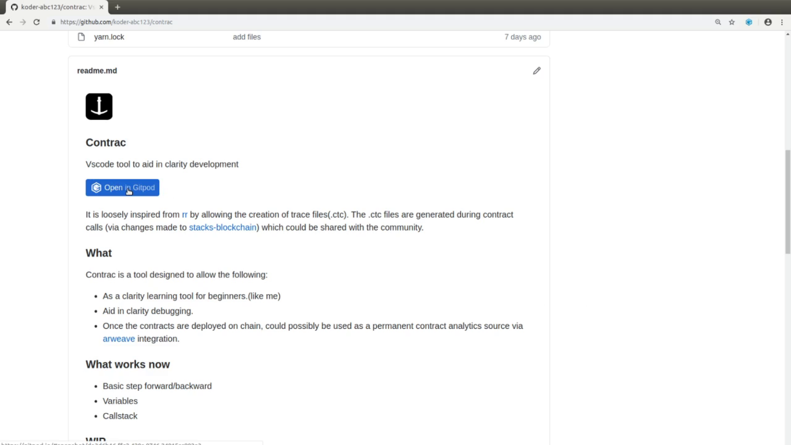
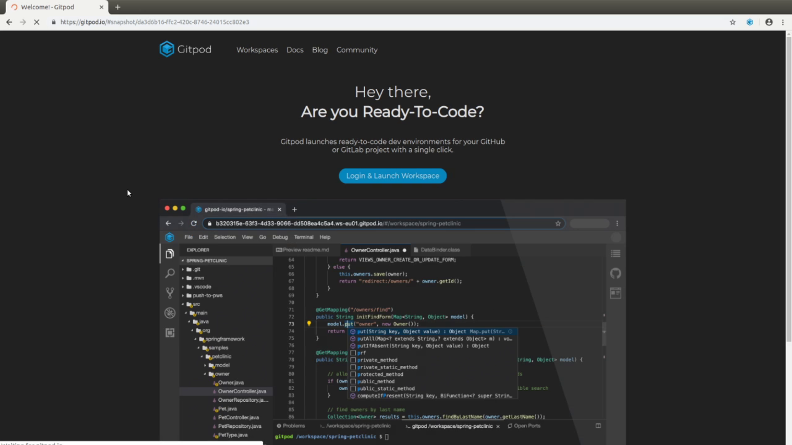
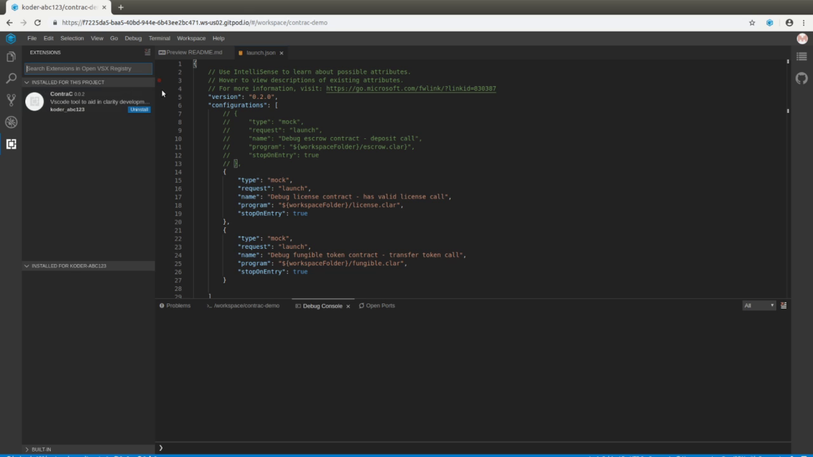
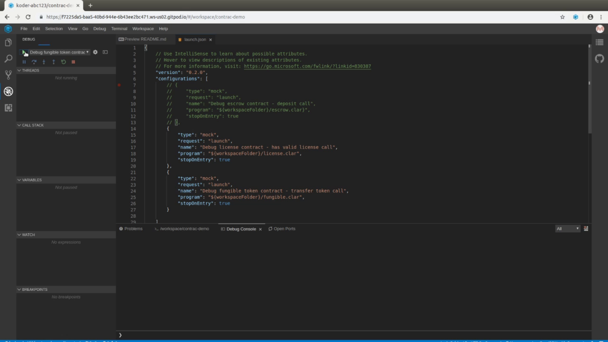
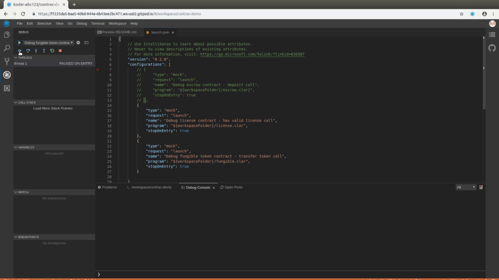
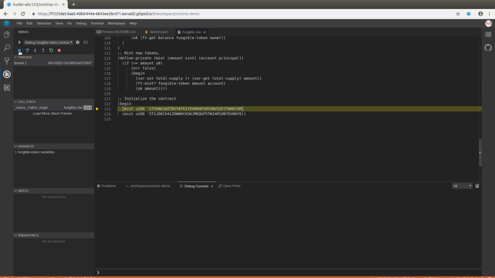

#### Step 1
Click on "Open in Gitpod" link

#### Step 2
Log into Gitpod.io

#### Step 3
Once logged in, ensure the contrac plug in installed under the extension section

#### Step 4
Get into the debugger section and click on the "green" debugger start button

#### Step 5
The debugger loads up , click on the "blue" continue button to step through

#### Step 6
Repeat step 5 till step thru ends.

