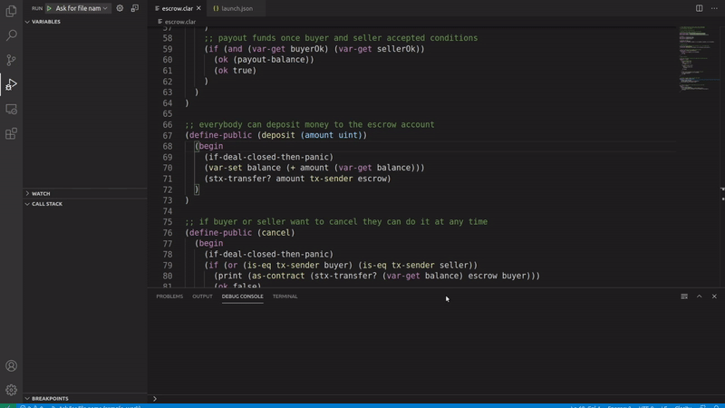
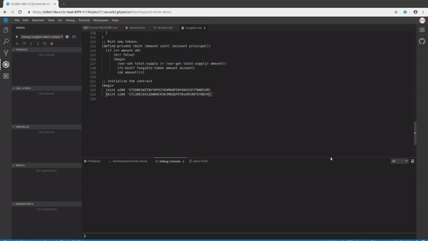

<h3>Contrac</h3>

Vscode tool to aid in clarity development

It is loosely inspired from [rr](https://github.com/mozilla/rr) by allowing the creation of trace files(.ctc).
The .ctc files are generated during contract calls (via changes made to [stacks-blockchain](https://github.com/koder-abc123/stacks-blockchain/commits/contrac_support)) which could be shared with the community.

### What
Contrac is a tool designed to allow the following:
- As a clarity learning tool for beginners.(like me)
- Aid in clarity debugging.
- Once the contracts are deployed on chain, could possibly be used as a permanent contract analytics source via [arweave](https://github.com/ArweaveTeam/arweave) integration.

### What works now
- Basic step forward/backward
- Variables
- Callstack

### WIP
- Howtos
- Breakpoints
- Watchpoints

## TBD
- Right now single contract calls are tracked, nested contract call tracking is required.

## VSCode

## Gitpod

## License
[MIT](https://choosealicense.com/licenses/mit/)